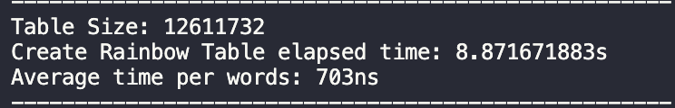

# Activity I: Hacking Password <!-- omit in toc -->

ในรายงานฉบับนี้จะมีบางส่วนของโปรแกรมปรากฏอยู่ ซึ่งเขียนด้วยภาษา Golang สามารถดู Code เต็ม ๆ ได้ที่ [2110413-COMP-SECURITY Activity 1](https://github.com/saenyakorn/2110413-COMP-SECURITY/tree/main/activity1)

## Table of Contents <!-- omit in toc -->

- [Problem 1](#problem-1)
	- [Answer](#answer)
- [Problem 2](#problem-2)
	- [Answer](#answer-1)
- [Problem 3](#problem-3)
	- [Answer](#answer-2)
- [Problem 4](#problem-4)
	- [Answer](#answer-3)
- [Problem 5](#problem-5)
	- [Answer](#answer-4)
- [Problem 6](#problem-6)
	- [Answer](#answer-5)

## Problem 1

Write a simple python program to use the word from the dictionary to find the original value of `d54cc1fe76f5186380a0939d2fc1723c44e8a5f7`.
Note that you might want to include substitution in your code (lowercase, uppercase, number for letter [‘o’ => 0 , ‘l’ => 1, ‘i’ => 1]).

### Answer

จาก [Dictionary](https://github.com/danielmiessler/SecLists/blob/master/Passwords/Common-Credentials/10k-most-common.txt) ที่ได้มา พบว่า `ThaiLanD` มีค่า Hash เป็น `d54cc1fe76f5186380a0939d2fc1723c44e8a5f7` เมื่อใช้ SHA1 hashing function

โดยขั้นตอนแรกเราจะ load text เข้ามาใน program ก่อน จากนั้นทำการ **substitute** คำเหล่านั้นเป็นหลาย ๆ คำ เช่น

`hello` -> `HeEllO`

จากนั้นก็ใช้ MD5 และ SHA1 hashing function ลอง hash generated text แล้วลองเทียบกับ target ดู

Function ในการหาคำตอบ

```Golang
func (d *Dictionary) FindOriginalPassword(targetHashedPwd string, substitutedPasswords []string) (string, method.Method) {
	// Check with MD5 hash function
	if pwd, correct := password.CheckPasswords(substitutedPasswords, targetHashedPwd, method.MethodMD5); correct {
		return pwd, method.MethodMD5
	}

	// Check with SHA1 Hash function
	if pwd, correct := password.CheckPasswords(substitutedPasswords, targetHashedPwd, method.MethodSHA1); correct {
		return pwd, method.MethodSHA1
	}

	return "", ""
}
```

Function ในการหา `substitutedPasswords`

```Golang
func (d *Dictionary) SubstituteText(text string) []string {
	results := make([]string, 0)
	queue := []Queue{
		{text, 0},
	}

	for len(queue) > 0 {
		target := queue[0]
		results = append(results, target.item)
		queue = queue[1:]
		for i := target.start; i < len(target.item); i++ {
			for _, p := range d.patterns {
				for pIdx, s := range p {
					// Ignore the unmatch pattern
					if s != string(target.item[i]) {
						continue
					}
					// Change it to many form and then add them to queue
					removedP := remove(p, pIdx)
					for _, s := range removedP {
						newText := target.item[:i] + s + target.item[i+1:]
						queue = append(queue, Queue{newText, i + 1})
					}
				}
			}
		}
	}

	return results
}
```

## Problem 2

For the given dictionary, create a rainbow table (including the substituted strings) using the sha1 algorithm. Measure the time for creating such a table. Measure the size of the table.

### Answer

ในการสร้างตาราง Hash Table เราสามารถ map ได้ด้วยวิธีนี้

```Golang
func createTable(words []string) map[string]string {
	table := make(map[string]string)

	for _, item := range words {
		hashedItem := hasher.GetSHA1Hash(item)
		table[item] = hashedItem
	}

	return table
}
```

ซึ่งจากการทดลองในเครื่องพบว่าการสร้างตารางทั้งหมดใช้เวลาและขนาดดังนี้



## Problem 3

Based on your code, how long does it take to perform a hash (sha1) on a password string? Please analyze the performance of your system.

### Answer

Assume ว่า Password จะมีเฉพาะอักษร a-z หรือ A-Z เท่านั้น เมื่อลองใช้ Computer ของตัวเองในการ Hash Password ดังกล่าวด้วยความยาวที่ต่างกัน ได้ผลลัพธ์ดังนี้


| length | hash rate |
| ------ | --------- |
| 1      | 299 ns    |
| 2      | 304 ns    |
| 4      | 258 ns    |
| 5      | 256 ns    |

สังเกตว่า Hash Rate หรือความเร็วในการ Hash text ต่อ 1 คำในแต่ละความยาวของคำมีค่าใกล้เคียงกัน ดังนั้นจึงขอสรุปว่า ระยะเวลาที่ใช้ในการ Hash Password 1 ตัวของ Computer เครื่องนี้มีเฉลี่ยประมา​ณ 280 ns

## Problem 4

If you were a hacker obtaining a password file from a system, estimate how long it takes to break a password with brute force using your computer. (Please based the answer on your measurement from exercise #3.)

### Answer

จาก Assumption ของ Password ข้างต้น เราจะได้ว่าใน 1 อักษรมีจะมีความเป็นไปได้ของตัวอักษรทั้งหมด 52 ตัว

ซึ่งการ Bruceforce password จะใช้เวลาขึ้นอยู่กับความยาวของ password ที่ต้องการโจมตี

ดังนั้นเราสามารถทำตาราง "จำนวนคำเมื่อกำหนดความยาวของคำ" และ "คำนวณ Hash Time" ได้ดังตารางนี้

Note: hash time = words \* 280 ns

| length | words                        | hash time |
| ------ | ---------------------------- | --------- |
| 1      | 52^1 = 52                    | 14.56 µs  |
| 2      | 52^2 = 2,704                 | 757.12 µs |
| 4      | 52^3 = 140,608               | 39.37 ms  |
| 4      | 52^3 = 7,311,616             | 2.04 s    |
| 5      | 52^5 = 380,204,032           | 1.77 min  |
| 6      | 52^6 = 19,770,609,664        | 1.54 hr   |
| 7      | 52^7 = 1,028,071,702,528     | 3.33 d    |
| 8      | 52^8 = 53,459,728,531,456    | 5.77 mo   |
| 9      | 52^9 = 2,779,905,883,635,710 | 25.02 yr  |

## Problem 5

Base on your analysis in exercise #4, what should be the proper length of a password. (e.g. Take a year or longer to break).

### Answer

จาก [ตารางในข้อ 4](#problem-4) พบว่า ถ้าต้องการให้ password ใช้เวลาเดามากกว่า 1 ปีด้วย Bruceforce จะต้องใช้ Password ที่มีความยาวมากกว่า 8 ขึ้นไป

## Problem 6

What is salt? Please explain its role in protecting a password hash.

### Answer

Salt คือ random string ที่เติมเข้าไปใน passowrd ก่อนจะ hash ซึ่งกระบวนการนี้จะการันตีว่า salted password ทีไ่ด้จะ unique เสมอ แม้ว่าจะมี original password เดียวกันก็ตาม โดย salt จะสร้างมาจาก cryptographically secure function ซึ่งจะทำให้การโดนโจมตีด้วย Bruceforce / Hash table ทำได้ยากขึ้น เช่น

- Password: `Hello`
- Salt: `Fopm3`
- Salted Password: `Fopm3Hello`
- Hashed Password: `7528ed35c6ebf7e4661a02fd98ab88d92ccf4e48a4b27338fcc194b90ae8855c`
