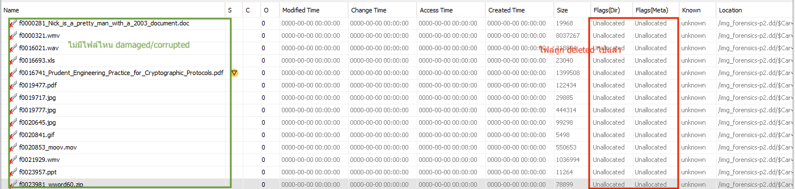
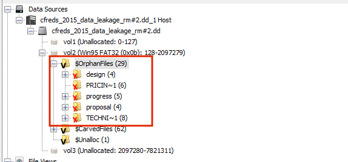
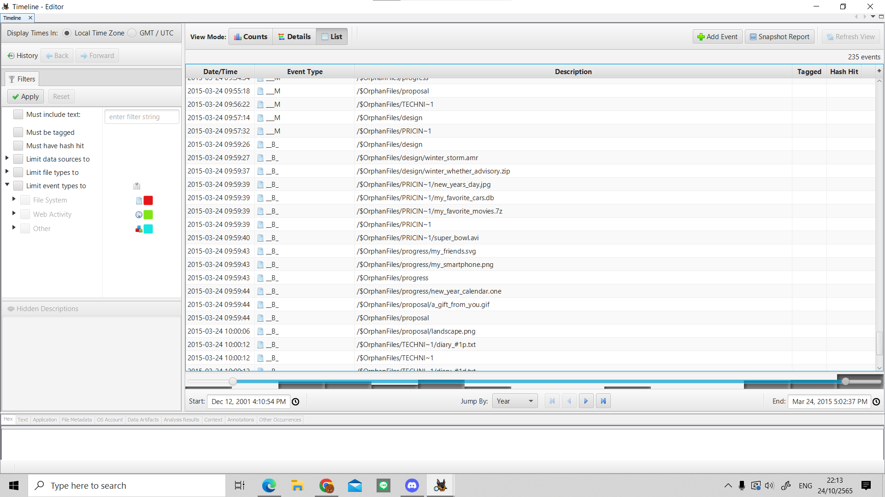
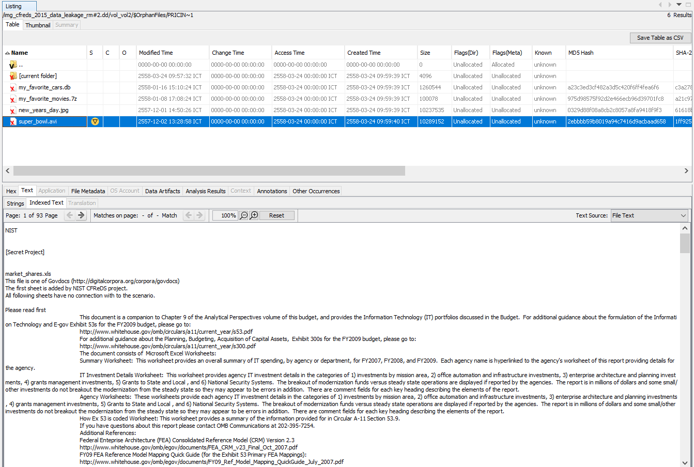
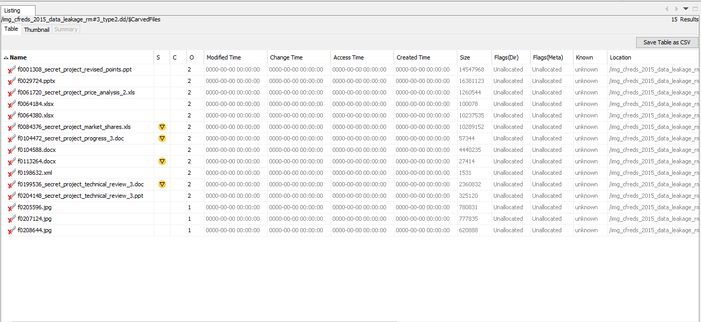
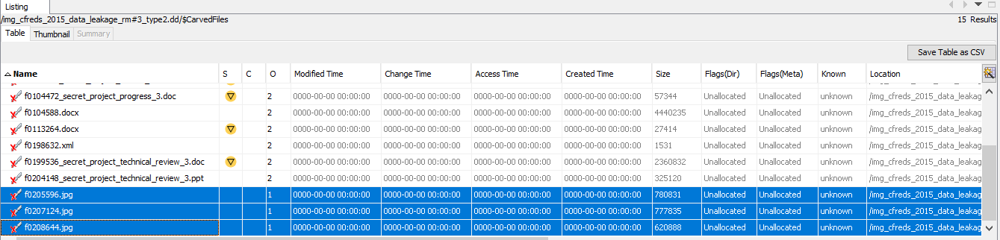

# Activity X: Computer Forensics <!-- omit in toc -->

By Saenyakorn Siangsanoh 6232035721 and Poravee Binhayeearason 6230314421

สามารถดู Resource เต็ม ๆ ได้ที่ [2110413-COMP-SECURITY Activity 10](https://github.com/saenyakorn/2110413-COMP-SECURITY/tree/main/activity10)

# Table of Contents <!-- omit in toc -->

- [Part I File Carving](#part-i-file-carving)
  - [1](#1)
    - [Answer](#answer)
  - [2](#2)
    - [Answer](#answer-1)
  - [3](#3)
    - [Answer](#answer-2)
  - [4](#4)
    - [Answer](#answer-3)
  - [5](#5)
    - [Answer](#answer-4)
- [Part II Investigation](#part-ii-investigation)
  - [1](#1-1)
    - [Answer](#answer-5)
  - [2](#2-1)
    - [Answer](#answer-6)
  - [3](#3-1)
    - [Answer](#answer-7)
  - [4](#4-1)
    - [Answer](#answer-8)
  - [5](#5-1)
    - [Answer](#answer-9)
  - [6](#6)
    - [Answer](#answer-10)

# Part I File Carving

## 1

Look at the data on the file system (Click on Data Sources and look at the hex values on the right). The file system has no files, but why are we able to find items on the disk image? Explain why the file system has no files but there are items that can be found on the disk image.

### Answer

เพราะหลาย ๆ file ที่ถูกลบ ถูกลบด้วยวิธี Quick format ซึ่งมันจะทำการลบไฟล์ด้วยวิธี mark ว่าพื้นที่ตรงนั้นสามารถเขียนทับได้ แต่ไม่มีการ write ให้ที่ตรงนั้นเป็นค่าว่าง ดังนั้นเราจึงยังสามารถดูไฟล์ที่ถูกลบได้

## 2

How many objects can you find?

### Answer

14 Objects

## 3

List all the objects here and report on whether or not the content is accessible or damaged/corrupted. Also note which files were actually already deleted.

### Answer

## 4

Think securely: If we want to delete files on a magnetic hard disk and not have them be recovered by any tool, what do we need to do? And how much time do you think you need to wipe a 1TB magnetic hard disk?

### Answer

Overwrite hard disk อย่างน้อย 1-3 ครั้งเพื่อให้มั่นใจว่าทุก bad sector ถูกเขียนทับแล้ว โดยเราสามารถคำนวณเวลาที่ใช้ได้โดยการ สมมติว่า hard disk 1TB และ write speed ของ hard disk คือ 100MB/s ดังนั้นใช้เวลา 10,000s = 2.78 ชั่วโมง ต่อการ write 1 ครั้ง

## 5

Will file carving be able to recover deleted files on an SSD? Why or why not?

### Answer

กู้ได้ ถ้าหากว่า data ที่โดน TRIM ไปแล้วยังไม่ถูกเขียนทับด้วยข้อมูลอื่น

# Part II Investigation

## 1

List all directories that were traversed in ‘RM#2’.

### Answer

## 2

List all files that were opened in 'RM#2’.

### Answer

## 3

Recover deleted files from USB drive ‘RM#2’. What files were you able to recover?

### Answer

ทุกไฟล์ใน `CarvedFiles` และ `OrphanFiles` folder

## 4

What actions were performed for anti-forensics on USB drive ‘RM#2’?

[Hint: this can be inferred from the results of the above question]

### Answer

สังเกตว่าไฟล์ทั้งหลายมี Flag unallocated ซึ่งแปลว่ามีการพยายามลบข้อมูลด้วย Quick Format

## 5

Recover hidden files from the CD-R ‘RM#3’. What files were you able to recover?

### Answer

ทุกไฟล์ใน `CarvedFiles`

## 6

What actions were performed for anti-forensics on CD-R ‘RM#3’?

### Answer

สังเกตว่าไฟล์ทั้งหลายมี Flag unallocated ซึ่งแปลว่ามีการพยายาม format CD-R เพื่อซ่อนข้อมูลบางอย่าง
