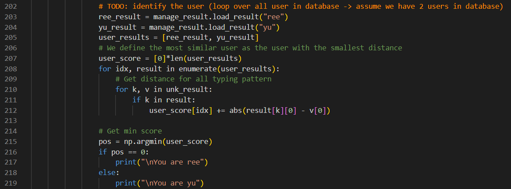
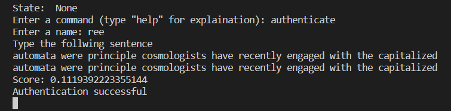

# Activity VII: Soft Biometric (Keystroke) <!-- omit in toc -->

By Saenyakorn Siangsanoh 6232035721 and Poravee Binhayeearason 6230314421

สามารถดู Resource เต็ม ๆ ได้ที่ [2110413-COMP-SECURITY Activity 11](https://github.com/saenyakorn/2110413-COMP-SECURITY/tree/main/activity11)

# Table of Contents <!-- omit in toc -->

- [1](#1)
  - [Answer](#answer)
- [2](#2)
  - [Answer](#answer-1)
- [3](#3)
  - [Answer](#answer-2)
- [Assets](#assets)

# 1

How many words do we need to correctly identify the person?

## Answer

เราได้ทำการเขียนโปรแกรมทำการสร้าง digraph โดยเชื่อว่าเป็น biometric ของบุคคลที่แตกต่างกัน ประกอบด้วย

code ของ การสร้างคำเพื่อใช้ทดสอบ

code ของ การสร้าง digraph

code ของการ load, store digraph ทีได้

code ของการตรวจสอบ similarity

เพื่อที่จะให้มี digraph ที่มีขนาดใหญ่พอที่จะใช้เปรียบเทียบ จำเป็นจะต้องใช้อย่างน้อย 10 คำ ที่ต้องมีคู้ของตัวอัักษรไม่ซ้ำกัน

# 2

Do you think this method is scalable? (to thousand persons) for either recognition system or identification system. Please provide your analysis.

## Answer

ไม่ เพราะ มีหลายคนที่มีวิธีการเขียนที่เหมือนกันมาก เช่น พวกนักแข่งพิมพ์จะพิมพ์กันได้อย่ารวดเร็วทำให้ error ที่ได้น้อยจนไม่สามารถระบุได้ว่าใครเป็นใคร เมื่อเทียบกับคนธรรมดาที่พิมพ์ช้ากว่า

# 3

Will you use this kind of authentication in your system? Please also provide a reason

## Answer

ไม่ใช้ เพราะเป็นการ authenticate ที่อ่อนเกินไป และความเป็นตัวตนน้อยเกินไป หมายความว่าอาจจะมีคนอื่นที่มีวิธีการพิมพ์เหมือนเราก็ได้

# Assets

