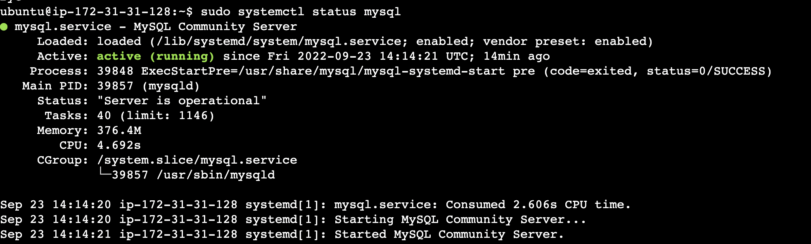

# Activity VII: Network Security <!-- omit in toc -->

By Saenyakorn Siangsanoh 6232035721 and Poravee Binhayeearason 6230314421

สามารถดู Resource เต็ม ๆ ได้ที่ [2110413-COMP-SECURITY Activity 7](https://github.com/saenyakorn/2110413-COMP-SECURITY/tree/main/activity7)

# Table of Contents <!-- omit in toc -->

- [Preface](#preface)
- [Q1](#q1)
  - [Answer](#answer)
- [Q2](#q2)
  - [Answer](#answer-1)
- [Q3](#q3)
  - [Answer](#answer-2)
- [Q4](#q4)
  - [Answer](#answer-3)
- [Q5](#q5)
  - [Answer](#answer-4)
- [Q6](#q6)
  - [Answer](#answer-5)
- [Q7](#q7)
  - [Answer](#answer-6)
- [Q8](#q8)
  - [Answer](#answer-7)
- [Q9](#q9)
  - [Answer](#answer-8)

# Preface

ในเอกสารฉบับนี้เรามีเครื่องทั้งหมด 3 เครื่องด้วยกัน

1. Attacker notebook - MacOS version 12.5 เป็นเครื่องที่มีอยู่จริง
2. Attacker VM (public IP: `13.215.163.115`, private IP: `172.31.20.169`) - เป็น EC2 ที่อยู่ใน VPC default เอาไว้ nmap ดูอีกเครื่องหนึ่ง
3. Victim VM (public IP: `3.1.83.118`, private IP: `172.31.18.135`) - เป็น EC2 ที่อยู่ใน VPC default โดยจะรัน service ssh, http, mysql เอาไว้

# Q1

Notice the open ports on all 3 devices (the attacker notebook, the target notebook, and the target Linux VM). Does anything look suspicious, i.e., some ports that you are not aware of that are open on the VM or on your notebooks?

## Answer

Attacker notebook

```txt
PORT     STATE    SERVICE            VERSION
631/tcp  open     ipp                CUPS 2.3
| http-robots.txt: 1 disallowed entry
|_/
|_http-title: Home - CUPS 2.3.4
| http-methods:
|_  Supported Methods: GET HEAD POST OPTIONS
|_http-server-header: CUPS/2.3 IPP/2.1
5000/tcp open     rtsp               AirTunes rtspd 620.8.2
|_rtsp-methods: ERROR: Script execution failed (use -d to debug)
5432/tcp open     postgresql         PostgreSQL DB 9.6.0 or later
| fingerprint-strings:
|   SMBProgNeg:
|     SFATAL
|     VFATAL
|     C0A000
|     Munsupported frontend protocol 65363.19778: server supports 2.0 to 3.0
|     Fpostmaster.c
|     L2127
|_    RProcessStartupPacket
6881/tcp filtered bittorrent-tracker
7000/tcp open     rtsp               AirTunes rtspd 620.8.2
```

Attacker VM

```txt
Not shown: 998 closed ports
PORT   STATE SERVICE VERSION
22/tcp open  ssh     OpenSSH 8.9p1 Ubuntu 3 (Ubuntu Linux; protocol 2.0)
80/tcp open  http    Apache httpd 2.4.52 ((Ubuntu))
|_http-server-header: Apache/2.4.52 (Ubuntu)
|_http-title: Apache2 Ubuntu Default Page: It works
Service Info: OS: Linux; CPE: cpe:/o:linux:linux_kernel
```

Victim VM

```txt
Not shown: 996 filtered tcp ports (no-response)
PORT     STATE  SERVICE VERSION
22/tcp   open   ssh     OpenSSH 8.9p1 Ubuntu 3 (Ubuntu Linux; protocol 2.0)
| ssh-hostkey:
|   256 6549c620dce8a74ddc9e4e2afb92fd5f (ECDSA)
|_  256 d9fa05a9b0e07ed9074b79f99709561a (ED25519)
80/tcp   open   http    Apache httpd 2.4.52 ((Ubuntu))
|_http-server-header: Apache/2.4.52 (Ubuntu)
|_http-title: Apache2 Ubuntu Default Page: It works
443/tcp  closed https
3306/tcp open   mysql   MySQL (unauthorized)
Service Info: OS: Linux; CPE: cpe:/o:linux:linux_kernel
```

# Q2

Look at the information provided by nmap about your OS's on all 3 devices. Is the information correct? Why is it or why is it not correct?

## Answer

สำหรับ Attacker ถูกต้องเพราะว่าเครื่องของ attacker มี PostgresSQL version 9.3.0 รันอยู่จริง และนอกนั้นคือเป็น protocol ของ MacOS ที่มีอยู่จริง

สำหรับ Victim VM ก็เป็นข้อมูลที่ถูกต้อง เพราะมี Apache2 รันอยู่จริง version 2.4.41 จริง และมี MySQL server รันอยู่จริง




# Q3

What do you think about the information you can get using nmap? Scary?

## Answer

เป็นข้อมูลที่มีประโยชน์กับ Hacker มากเพราะจะได้รู้ว่าตอนนี้มี service อะไรรันอยู๋บ้างในเครื่องของเหยื่อ และยิ่งไปกว่านั้นคือ version ของ service ที่ใช้เพราะในแต่ version ก็จะมีช่องโหว่ที่แตกต่างกันออกไป ทำให้ Hacker สามารถเลือกได้ว่าจะใช้ท่าไหนในการล้วงข้อมูล

# Q4

Look at the access.log file for the web server in your Linux VM. What IP addresses do you see accessing the web server? Which devices do these IP addresses belong to?

## Answer

จากข้อมูลในข้อ 5 พบว่า IP ที่เข้ามาด้วย nmap (compatible; Nmap Scripting Engine;) จะมี 2 IP ได้แก่ `172.31.20.169` ซึ่งเป็น IP ของ Attacker VM และ `49.228.234.67` ซึ่งเป็น IP ของ Attacker notebook และมากไปกว่านั้น ยังบอกด้วยว่าถูกยิงด้วย Mozilla/5.0 (compatible; NMAP scripting engine) และ HTTP Method GET, POST และ OPTIONS

# Q5

Find the nmap scan in the web server log. Copy the lines from the log file that were created because of the nmap scan.

## Answer

```txt
172.31.20.169 - - [23/Sep/2022:15:10:24 +0000] "GET / HTTP/1.0" 200 10945 "-" "-"
172.31.20.169 - - [23/Sep/2022:15:10:24 +0000] "GET /nmaplowercheck1663945824 HTTP/1.1" 404 490 "-" "Mozilla/5.0 (compatible; Nmap Scripting Engine; https://nmap.org/book/nse.html)"
172.31.20.169 - - [23/Sep/2022:15:10:24 +0000] "GET / HTTP/1.1" 200 10945 "-" "Mozilla/5.0 (compatible; Nmap Scripting Engine; https://nmap.org/book/nse.html)"
172.31.20.169 - - [23/Sep/2022:15:10:24 +0000] "GET / HTTP/1.0" 200 10945 "-" "-"
172.31.20.169 - - [23/Sep/2022:15:10:24 +0000] "POST / HTTP/1.1" 200 10945 "-" "Mozilla/5.0 (compatible; Nmap Scripting Engine; https://nmap.org/book/nse.html)"
172.31.20.169 - - [23/Sep/2022:15:10:24 +0000] "POST /sdk HTTP/1.1" 404 490 "-" "Mozilla/5.0 (compatible; Nmap Scripting Engine; https://nmap.org/book/nse.html)"
172.31.20.169 - - [23/Sep/2022:15:10:24 +0000] "OPTIONS / HTTP/1.1" 200 181 "-" "Mozilla/5.0 (compatible; Nmap Scripting Engine; https://nmap.org/book/nse.html)"
172.31.20.169 - - [23/Sep/2022:15:10:24 +0000] "OPTIONS / HTTP/1.1" 200 181 "-" "Mozilla/5.0 (compatible; Nmap Scripting Engine; https://nmap.org/book/nse.html)"
172.31.20.169 - - [23/Sep/2022:15:10:24 +0000] "PROPFIND / HTTP/1.1" 405 558 "-" "Mozilla/5.0 (compatible; Nmap Scripting Engine; https://nmap.org/book/nse.html)"
172.31.20.169 - - [23/Sep/2022:15:10:24 +0000] "GET /robots.txt HTTP/1.1" 404 490 "-" "Mozilla/5.0 (compatible; Nmap Scripting Engine; https://nmap.org/book/nse.html)"
172.31.20.169 - - [23/Sep/2022:15:10:24 +0000] "OPTIONS / HTTP/1.1" 200 181 "-" "Mozilla/5.0 (compatible; Nmap Scripting Engine; https://nmap.org/book/nse.html)"
172.31.20.169 - - [23/Sep/2022:15:10:24 +0000] "PROPFIND / HTTP/1.1" 405 558 "-" "Mozilla/5.0 (compatible; Nmap Scripting Engine; https://nmap.org/book/nse.html)"
172.31.20.169 - - [23/Sep/2022:15:10:24 +0000] "GET /.git/HEAD HTTP/1.1" 404 490 "-" "Mozilla/5.0 (compatible; Nmap Scripting Engine; https://nmap.org/book/nse.html)"
172.31.20.169 - - [23/Sep/2022:15:10:24 +0000] "GET /HNAP1 HTTP/1.1" 404 490 "-" "Mozilla/5.0 (compatible; Nmap Scripting Engine; https://nmap.org/book/nse.html)"
172.31.20.169 - - [23/Sep/2022:15:10:24 +0000] "PROPFIND / HTTP/1.1" 405 558 "-" "Mozilla/5.0 (compatible; Nmap Scripting Engine; https://nmap.org/book/nse.html)"
172.31.20.169 - - [23/Sep/2022:15:10:24 +0000] "OPTIONS / HTTP/1.1" 200 181 "-" "Mozilla/5.0 (compatible; Nmap Scripting Engine; https://nmap.org/book/nse.html)"
172.31.20.169 - - [23/Sep/2022:15:10:24 +0000] "LZEA / HTTP/1.1" 501 533 "-" "Mozilla/5.0 (compatible; Nmap Scripting Engine; https://nmap.org/book/nse.html)"
172.31.20.169 - - [23/Sep/2022:15:10:24 +0000] "GET /favicon.ico HTTP/1.1" 404 490 "-" "Mozilla/5.0 (compatible; Nmap Scripting Engine; https://nmap.org/book/nse.html)"
172.31.20.169 - - [23/Sep/2022:15:10:24 +0000] "GET /evox/about HTTP/1.1" 404 490 "-" "Mozilla/5.0 (compatible; Nmap Scripting Engine; https://nmap.org/book/nse.html)"
172.31.20.169 - - [23/Sep/2022:15:10:24 +0000] "OPTIONS / HTTP/1.1" 200 181 "-" "Mozilla/5.0 (compatible; Nmap Scripting Engine; https://nmap.org/book/nse.html)"
172.31.20.169 - - [23/Sep/2022:15:10:24 +0000] "OPTIONS / HTTP/1.1" 200 181 "-" "Mozilla/5.0 (compatible; Nmap Scripting Engine; https://nmap.org/book/nse.html)"
172.31.20.169 - - [23/Sep/2022:15:10:24 +0000] "GET / HTTP/1.1" 200 10945 "-" "Mozilla/5.0 (compatible; Nmap Scripting Engine; https://nmap.org/book/nse.html)"
172.31.20.169 - - [23/Sep/2022:15:10:24 +0000] "OPTIONS / HTTP/1.1" 200 181 "-" "Mozilla/5.0 (compatible; Nmap Scripting Engine; https://nmap.org/book/nse.html)"
172.31.20.169 - - [23/Sep/2022:15:10:24 +0000] "OPTIONS / HTTP/1.1" 200 181 "-" "Mozilla/5.0 (compatible; Nmap Scripting Engine; https://nmap.org/book/nse.html)"
172.31.20.169 - - [23/Sep/2022:15:10:24 +0000] "OPTIONS / HTTP/1.1" 200 181 "-" "Mozilla/5.0 (compatible; Nmap Scripting Engine; https://nmap.org/book/nse.html)"
172.31.20.169 - - [23/Sep/2022:15:10:24 +0000] "OPTIONS / HTTP/1.1" 200 181 "-" "Mozilla/5.0 (compatible; Nmap Scripting Engine; https://nmap.org/book/nse.html)"
172.31.20.169 - - [23/Sep/2022:15:10:24 +0000] "OPTIONS / HTTP/1.1" 200 181 "-" "Mozilla/5.0 (compatible; Nmap Scripting Engine; https://nmap.org/book/nse.html)"
172.31.20.169 - - [23/Sep/2022:15:10:24 +0000] "GET / HTTP/1.0" 200 10945 "-" "-"
172.31.20.169 - - [23/Sep/2022:15:10:24 +0000] "GET / HTTP/1.1" 200 10926 "-" "-"
49.228.234.67 - - [23/Sep/2022:15:12:43 +0000] "GET / HTTP/1.0" 200 10945 "-" "-"
49.228.234.67 - - [23/Sep/2022:15:12:43 +0000] "GET / HTTP/1.1" 200 10945 "-" "Mozilla/5.0 (compatible; Nmap Scripting Engine; https://nmap.org/book/nse.html)"
49.228.234.67 - - [23/Sep/2022:15:12:43 +0000] "PROPFIND / HTTP/1.1" 405 561 "-" "Mozilla/5.0 (compatible; Nmap Scripting Engine; https://nmap.org/book/nse.html)"
49.228.234.67 - - [23/Sep/2022:15:12:43 +0000] "OPTIONS / HTTP/1.1" 200 181 "-" "Mozilla/5.0 (compatible; Nmap Scripting Engine; https://nmap.org/book/nse.html)"
49.228.234.67 - - [23/Sep/2022:15:12:43 +0000] "POST / HTTP/1.1" 200 10945 "-" "Mozilla/5.0 (compatible; Nmap Scripting Engine; https://nmap.org/book/nse.html)"
49.228.234.67 - - [23/Sep/2022:15:12:43 +0000] "PROPFIND / HTTP/1.1" 405 561 "-" "Mozilla/5.0 (compatible; Nmap Scripting Engine; https://nmap.org/book/nse.html)"
49.228.234.67 - - [23/Sep/2022:15:12:43 +0000] "VKUU / HTTP/1.1" 501 536 "-" "Mozilla/5.0 (compatible; Nmap Scripting Engine; https://nmap.org/book/nse.html)"
49.228.234.67 - - [23/Sep/2022:15:12:43 +0000] "GET /favicon.ico HTTP/1.1" 404 493 "-" "Mozilla/5.0 (compatible; Nmap Scripting Engine; https://nmap.org/book/nse.html)"
49.228.234.67 - - [23/Sep/2022:15:12:44 +0000] "GET / HTTP/1.1" 200 10945 "-" "Mozilla/5.0 (compatible; Nmap Scripting Engine; https://nmap.org/book/nse.html)"
49.228.234.67 - - [23/Sep/2022:15:12:44 +0000] "\x16\x03\x01\x02" 400 522 "-" "-"
49.228.234.67 - - [23/Sep/2022:15:12:44 +0000] "\x16\x03\x01\x02" 400 522 "-" "-"
49.228.234.67 - - [23/Sep/2022:15:12:44 +0000] "\x16\x03\x01\x02" 400 522 "-" "-"
49.228.234.67 - - [23/Sep/2022:15:12:44 +0000] "\x16\x03\x01\x02" 400 522 "-" "-"
49.228.234.67 - - [23/Sep/2022:15:12:44 +0000] "\x16\x03\x01\x02" 400 522 "-" "-"
49.228.234.67 - - [23/Sep/2022:15:12:44 +0000] "OPTIONS / HTTP/1.1" 200 181 "-" "Mozilla/5.0 (compatible; Nmap Scripting Engine; https://nmap.org/book/nse.html)"
49.228.234.67 - - [23/Sep/2022:15:12:44 +0000] "GET /HNAP1 HTTP/1.1" 404 493 "-" "Mozilla/5.0 (compatible; Nmap Scripting Engine; https://nmap.org/book/nse.html)"
49.228.234.67 - - [23/Sep/2022:15:12:44 +0000] "GET /nmaplowercheck1663945963 HTTP/1.1" 404 493 "-" "Mozilla/5.0 (compatible; Nmap Scripting Engine; https://nmap.org/book/nse.html)"
49.228.234.67 - - [23/Sep/2022:15:12:44 +0000] "OPTIONS / HTTP/1.1" 200 181 "-" "Mozilla/5.0 (compatible; Nmap Scripting Engine; https://nmap.org/book/nse.html)"
49.228.234.67 - - [23/Sep/2022:15:12:45 +0000] "GET /evox/about HTTP/1.1" 404 493 "-" "Mozilla/5.0 (compatible; Nmap Scripting Engine; https://nmap.org/book/nse.html)"
49.228.234.67 - - [23/Sep/2022:15:12:45 +0000] "OPTIONS / HTTP/1.1" 200 181 "-" "Mozilla/5.0 (compatible; Nmap Scripting Engine; https://nmap.org/book/nse.html)"
49.228.234.67 - - [23/Sep/2022:15:12:45 +0000] "OPTIONS / HTTP/1.1" 200 181 "-" "Mozilla/5.0 (compatible; Nmap Scripting Engine; https://nmap.org/book/nse.html)"
49.228.234.67 - - [23/Sep/2022:15:12:45 +0000] "PROPFIND / HTTP/1.1" 405 561 "-" "Mozilla/5.0 (compatible; Nmap Scripting Engine; https://nmap.org/book/nse.html)"
49.228.234.67 - - [23/Sep/2022:15:12:45 +0000] "OPTIONS / HTTP/1.1" 200 181 "-" "Mozilla/5.0 (compatible; Nmap Scripting Engine; https://nmap.org/book/nse.html)"
49.228.234.67 - - [23/Sep/2022:15:12:45 +0000] "OPTIONS / HTTP/1.1" 200 181 "-" "Mozilla/5.0 (compatible; Nmap Scripting Engine; https://nmap.org/book/nse.html)"
49.228.234.67 - - [23/Sep/2022:15:12:46 +0000] "OPTIONS / HTTP/1.1" 200 181 "-" "Mozilla/5.0 (compatible; Nmap Scripting Engine; https://nmap.org/book/nse.html)"
49.228.234.67 - - [23/Sep/2022:15:12:46 +0000] "OPTIONS / HTTP/1.1" 200 181 "-" "Mozilla/5.0 (compatible; Nmap Scripting Engine; https://nmap.org/book/nse.html)"
49.228.234.67 - - [23/Sep/2022:15:12:48 +0000] "GET / HTTP/1.0" 200 10945 "-" "-"
49.228.234.67 - - [23/Sep/2022:15:12:48 +0000] "GET / HTTP/1.1" 200 10926 "-" "-"
```

# Q6

After you successfully install your iptable rule(s), how do the reported results from your new nmap scan compare to your previous scan before using iptables? Look to see if OS detection, port open results, etc. have changed. Something(s) have definitely changed.

## Answer

เมื่อตั้งค่า iptables โดยจั้ง policy ว่า

1. ACCEPT ทุก packet เฉพาะ port 22 และ 80
2. DROP ทุก packet

ด้วยคำสั่ง

```bash
sudo iptables -A INPUT -p tcp --dport 80 -j ACCEPT
sudo iptables -A OUTPUT -p tcp --sport 80 -j ACCEPT
sudo iptables -A INPUT -p tcp --dport 22 -j ACCEPT
sudo iptables -A OUTPUT -p tcp --sport 22 -j ACCEPT
sudo iptables -P INPUT DROP
sudo iptables -P FORWARD DROP
sudo iptables -P OUTPUT ACCEPT
```

ผลลัพธ์การ `nmap` เป็นดังนี้

```txt
Not shown: 998 filtered ports
PORT   STATE SERVICE VERSION
22/tcp open  ssh     OpenSSH 8.9p1 Ubuntu 3 (Ubuntu Linux; protocol 2.0)
80/tcp open  http    Apache httpd 2.4.52 ((Ubuntu))
|_http-server-header: Apache/2.4.52 (Ubuntu)
|_http-title: Apache2 Ubuntu Default Page: It works
Service Info: OS: Linux; CPE: cpe:/o:linux:linux_kernel
```

พบว่า nmap scan ไม่เจอ mysql 3306 แล้ว นั่นเป็นเพราะว่าเรา drop ทุก packet ที่ไม่ได้ต่อ port 22 และ 80 ไว้

# Q7

Notice that nmap can still figure out you have Apache httpd running. Look at the access.log file for the web server in your Linux VM. Are the logs the same as in Part II?

## Answer

ได้ผลลัพธ์เหมือนเดิม

# Q8

Explain whether or not you could prevent nmap from reaching the web server while still allowing legitimate clients to get service. Will a firewall be sufficient for this? Or do you need some other device? Please think critically about this.

## Answer

โดยทั่วไปแล้ว เราไม่สามารถป้องกันการ nmap ที่เข้ามาดู web server ได้ สมมติว่าเจ้าของ server ไม่ต้องการให้คนจากประเทศหนึ่ง เข้าใช้งาน website เราสามารถ configure iptables ให้ DROP ทุก ip ที่มาจากประเทศนั้น แต่คนในประเทศนั้นก็อาจจะใช้ VPN เข้ามาหาเว็บเราได้อยู่ดี ถ้าพยายามพอ

มากไปกว่านั้น nmap ยังใช้วิธีการยิง HTTP Method ซึ่งก็เหมือนกันกับผู้ใช้ทั่วไป ดังนั้น firewall แยกไม่ออกอยู่แล้วว่า request ไหนคือลูกค้า หรือ nmap

# Q9

What are your firewall rules? Run `iptables -L` on your VM and enter the output here.

## Answer

```txt
Chain INPUT (policy DROP)
target     prot opt source               destination
ACCEPT     tcp  --  anywhere             anywhere             tcp dpt:http
ACCEPT     tcp  --  anywhere             anywhere             tcp dpt:ssh

Chain FORWARD (policy DROP)
target     prot opt source               destination

Chain OUTPUT (policy ACCEPT)
target     prot opt source               destination
ACCEPT     tcp  --  anywhere             anywhere             tcp spt:http
ACCEPT     tcp  --  anywhere             anywhere             tcp spt:ssh
```
