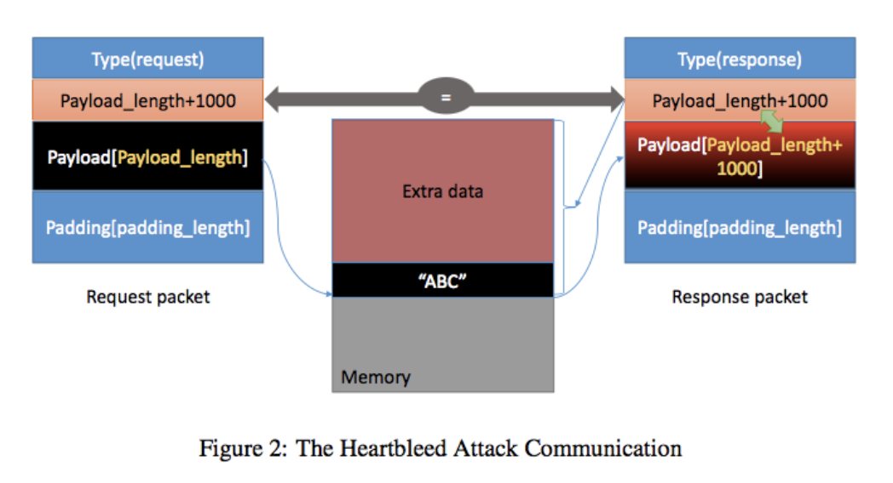

# Activity VIII: Network Security 2 <!-- omit in toc -->

By Saenyakorn Siangsanoh 6232035721 and Poravee Binhayeearason 6230314421

สามารถดู Resource เต็ม ๆ ได้ที่ [2110413-COMP-SECURITY Activity 8](https://github.com/saenyakorn/2110413-COMP-SECURITY/tree/main/activity8)

# Table of Contents <!-- omit in toc -->

- [Part II: DoS (Denial of Service)](#part-ii-dos-denial-of-service)
  - [Q1](#q1)
    - [Answer](#answer)
  - [Q2](#q2)
    - [Answer](#answer-1)
  - [Q3](#q3)
    - [Answer](#answer-2)
  - [Q4](#q4)
    - [Answer](#answer-3)
  - [Q5](#q5)
    - [Answer](#answer-4)
  - [Q6](#q6)
    - [Answer](#answer-5)
- [Part III: SSL Vulnerabilities](#part-iii-ssl-vulnerabilities)
  - [Q7](#q7)
    - [Answer](#answer-6)
  - [Q8](#q8)
    - [Answer](#answer-7)
  - [Q9](#q9)
    - [Answer](#answer-8)
  - [Q10](#q10)
    - [Answer](#answer-9)
  - [Q11](#q11)
    - [Answer](#answer-10)
  - [Q12](#q12)
    - [Answer](#answer-11)
  - [Q13](#q13)
    - [Answer](#answer-12)

# Part II: DoS (Denial of Service)

## Q1

What is the attacker's IP address?

### Answer

192.168.104.211

## Q2

What command did you use to run the attack?

### Answer

```bash
netwox 76 -p 192.168.104.37 -i 80
```

## Q3

How do you know the attack is successful? Hint: Use the browser on your notebook to access the webpage. What should happen if the attack is successful?

### Answer

สำเร็จเพราะเมื่อตรวจสอบด้วย `netstat -a` แล้วพบว่ามี connection ที่มี state เป็น `SYN_RECV` อยู๋จำนวนมาก และเมื่อเข้า Browser ก็พบว่าบางครั้งไม่สามารถเข้าใช้งานได้


## Q4

"netwox" performs the TCP SYN Flood attack using spoofed IP addresses. Give some examples of the spoofed IP addresses you see on the target machine.

### Answer


จะพบว่า row ที่มี state เป็น `SYN_RECV` จะมี foreign address แปลก ๆ เต็มไปหมด ซึ่งนั่นคือ spoofed IP addresses

## Q5

In the TCP SYN Flood attack, what resource on the server side is exhausted? What is the number of resources available, and how many of those resources get used up in the attack?

### Answer

TCP connection queue ถูกใช้ไปจำนวนมาก ซื้อเมื่อตรวจสอบด้วย `watch -n 5 'netstat -na | grep SYN_RECV'` แล้วได้ผลลัพธ์ระหว่างถูกโจมตีดังนี้


นั่นหมายความว่ามีการ request จำนวนมากจาก spoof ip address โดยที่ยังเป็น half-connection

## Q6

How do TCP SYN cookies prevent this type of attack?

### Answer

SYN Cookie จะทำหน้าที่ block request ที่เข้ามาด้วย port ที่ไม่ต้องการได้ ซึ่งส่งผลทำให้ถูกโจมตีด้วย netwox ได้น้อยลง (แต่ก็ยังสามารถถูกโจมตีได้เหมือนเดิม)

# Part III: SSL Vulnerabilities

## Q7

For each piece of secret that you steal from the Heartbleed attack, you need to show the screenshots as the proof. Upload a pdf of your screenshots

### Answer

User Activity (Message from Admin to Boby)


Admin username and password


## Q8

For the Heartbleed attack, explain how you did the attack, and what your observations are.

### Answer

ด้วย OpenSSL version เก่าจะมีช่องโหว่นึงนั่นก็คือ การที่ program ไมไ่ด้ตรวจสอบ payload_length ว่าสอดคล้องกับ payload หรือเปล่า และโดยธรรมชาติของการ response จะต้องเอา copy payload ที่ส่งมากลับไปด้วย

ดังนั้นหาก payload_length มีมากกว่า payload จริง ๆ program จะ copy buffer จาก memory มากเกินกว่าที่ควร (Buffer over-read) ทำให้อาจจะ copy ไปโดน private data ใน memory และ attacker อาจจะได้ข้อมูลทีี่อันตรายกลับไป

จากการสังเกตและการทดลอง จะพบว่าการโจมตีดังกล่าวได้ข้อมูลที่สำคัญออกมาจริง ๆ เช่นข้อมูลว่า user เคยทำอะไรไปแล้ว และข้อมูล username/password

## Q9

As the length variable decreases, what kind of difference can you observe?

### Answer

Output ที่ได้จากการรันโปรแกรมมีความยาวลดลง ข้อมูลที่ได้จาก private memory ของ victim น้อยลง

## Q10

As the length variable decreases, there is a boundary value for the input length variable. At or below that boundary, the Heartbeat query will receive a response packet without attaching any extra data (which means the request is benign). Please find that boundary length. You may need to try many different length values until the web server sends back the reply without extra data. To help you with this, when the number of returned bytes is smaller than the expected length, the program will print "Server processed malformed Heartbeat, but did not return any extra data." What is the boundary length?

### Answer

จากการทำ Binary Search พบว่า ค่าความยาวที่น้อยที่สุดที่ยังสามารถได้ข้อมูลเพิ่มเติมอยู่คือ 23 bytes

เมื่อลดความยาวจนเหลือ 22 bytes จะพบว่าโปรแกรมจะฟ้องว่า `Server processed malformed Heartbeat, but did not return any extra data.` ดังรูป


## Q11

Try your attack again after you have updated the OpenSSL library. Are you successful at stealing data from the server after the upgrade?

### Answer

หลังจาก update package ในเครื่อง victim แล้วลองโจมตีใหม่ จะได้ผลลัพธ์ดังนี้ ซึ่งแปลว่าช่องโหว่ได้ถูกแก้ไขแล้ว


## Q12

Please point out the problem from the code and provide a solution to fix the bug (i.e., what modification is needed to fix the bug). You do not need to recompile the code; just describe how you can fix the problem.

### Answer

จาก Diagram นี้



จะพบว่าช่องโหว่คือ payload size กับ payload length ไม่สัมพันธ์กัน ทำให้เราสามารถไปแอบเอาข้อมูลจาก private memory ได้

ดังนั้นวิธีแก้ไขคือการ validate payload size กับ payload length ต้องสัมพันธ์กัน

## Q13

Comment on the following discussions by Alice, Bob, and Eva regarding the fundamental cause of the Heartbleed vulnerability: Alice thinks the fundamental cause is missing the boundary checking during the buffer copy; Bob thinks the cause is missing the user input validation; Eva thinks that we can just delete the length value from the packet to solve everything. Who do you agree and disagree with, and why?

### Answer

**Alice**: เห็นด้วยว่าเราควรจะตรวจสอบก่อนว่าสิ่งที่ copy กับที่สิ่งจะ return อยู่ในขอบเขตเดียวกันหรือเปล่า

**Bob**: เห็นด้วยว่าเราควรจะตรวจสอบก่อนเสมอว่าสิ่งที่ user ส่งเข้ามา ถูกต้องหรือเปล่า ในที่นี้คือการ check payload_length กับ payload size ว่าตรงกันหรือไม่

**Eva**: ไม่เห็นด้วย เมื่อพืจารณา packet strcuture แล้วพบว่าหากไม่มี field payload_length จะทำให้ program ไม่รู้ว่า payload จะจบลงที่ bytes ที่เท่าไร เพราะด้านล่าง payload ก็ยังมี padding[padding_lenght] อีก
