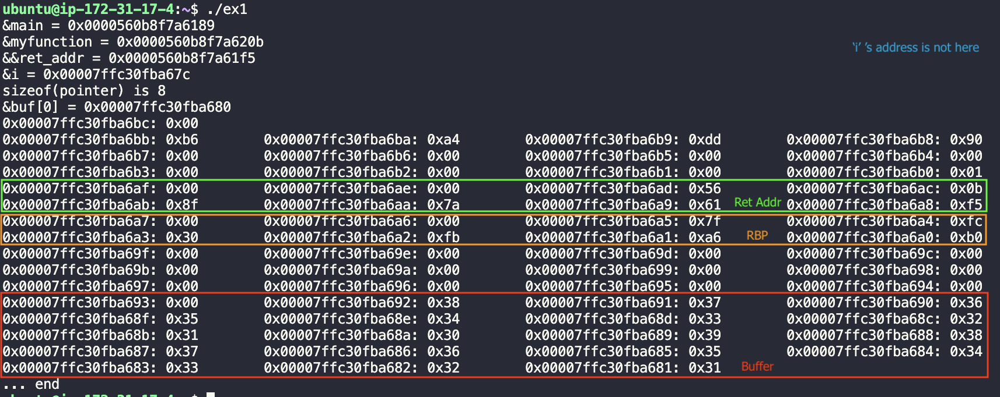
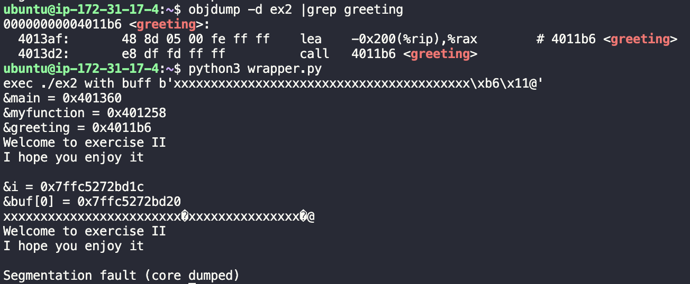
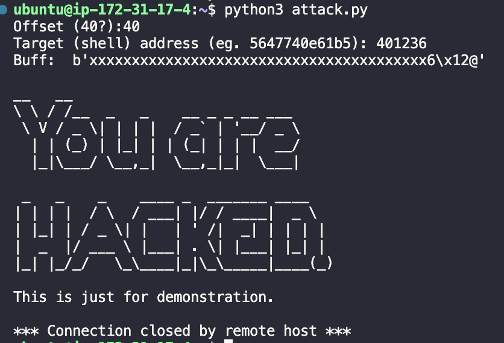

# Activity IX: Buffer Overflow <!-- omit in toc -->

By Saenyakorn Siangsanoh 6232035721

สามารถดู Resource เต็ม ๆ ได้ที่ [2110413-COMP-SECURITY Activity 9](https://github.com/saenyakorn/2110413-COMP-SECURITY/tree/main/activity9)

# Table of Contents <!-- omit in toc -->

- [Environment](#environment)
- [1 Stack Layout](#1-stack-layout)
  - [Answer](#answer)
- [2 Stack Smashing](#2-stack-smashing)
  - [Answer](#answer-1)
- [3 Challenging](#3-challenging)
  - [Answer](#answer-2)
- [4](#4)
  - [Answer](#answer-3)
- [5](#5)
  - [5.1](#51)
    - [Answer](#answer-4)
  - [5.2](#52)
    - [Answer](#answer-5)

# Environment

AMI: Ubuntu Server 22.04 TLS amd64
Instant Type: t2.micro
GCC version: gcc (Ubuntu 11.2.0-19ubuntu1) 11.2.0

# 1 Stack Layout

**Draw a stack** layout of your program. Start from the address of &**buf[0]** and stop at **&i+8**. Specify symbol and content (if possible). Make sure that you have identified
argument (i), and return address.

Please circle the result from the program above and write down the associated symbol. (Identify return address, buffer, local variables.)

## Answer

# 2 Stack Smashing

## Answer

# 3 Challenging

## Answer

# 4

From exercise 2 and 3, can you explode the buffer-overflow attack
even when the canary-style protection is activated? Please explain your analysis

## Answer

ทำได้ สมมติว่าเรารู้ค่า canary เราก็ overflow ส่วนที่เป็น canary ด้วย canary ที่เรารู้ แล้วก็เปลี่ยน return address ตามใจได้เหมือนเดิม

# 5

Now you have mastered a type buffer-overflow attack. Please
answer the following questions.

## 5.1

Most viruses and worms use buffer overflow as a basis for its attack. Do you think that exploiting buffer-overflow attacks is trivial? Please justify your answer. (i.e. Is it trivial to write a program to exploit buffer-overflow attacks in a server?)

### Answer

คิดว่าการโจทตีด้วย buffer overflow ไม่ใช่เรื่องเล็กน้อย เพราะว่า buffer overflow อาจจะ leak data บางอย่างได้ หรืออาจจะทำให้การทำงานของโปรแกรมเราผิดปกติ หรือ server เราอาจจะโดนติดตั้งโปรแกรมที่อันตรายได้ด้วย buffer overflow

## 5.2

As a programmer, is it possible to avoid buffer overflow in your program (write secure code that is not vulnerable to such attack)? Explain your strategy.

### Answer

เป็นไปได้ยากมาก ในภาษา low-level เช่น C, ASM เราต้องมาคอยระวังเรื่องขนาดของ Buffer ตลอดเวลา ซึ่งอาจจะมี human error บ้าง ส่วนภาษาระดับสูงก็ไม่สามารถการันตีได้ว่าจะไม่เกิด Buffer overflow เพราะภาษาระดับ high-level ก็ต้องแปลงกลับมาเป็น low-level ก่อนอยู่ดี
