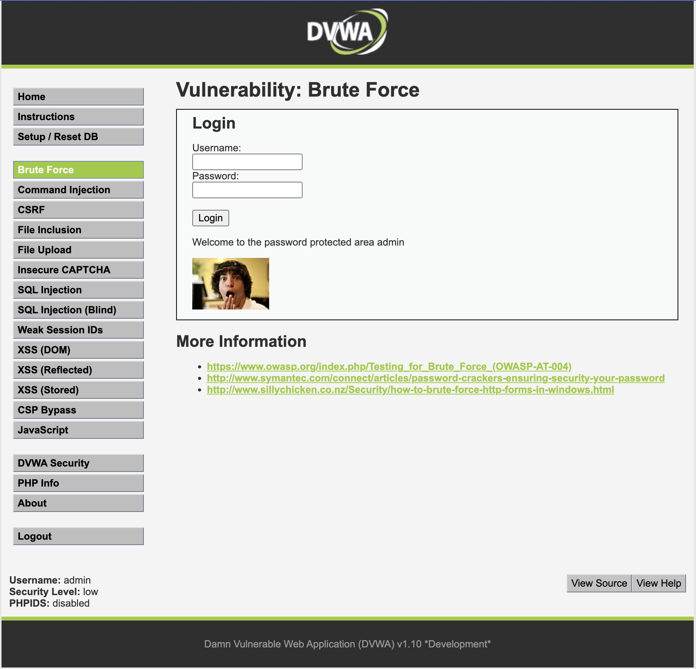
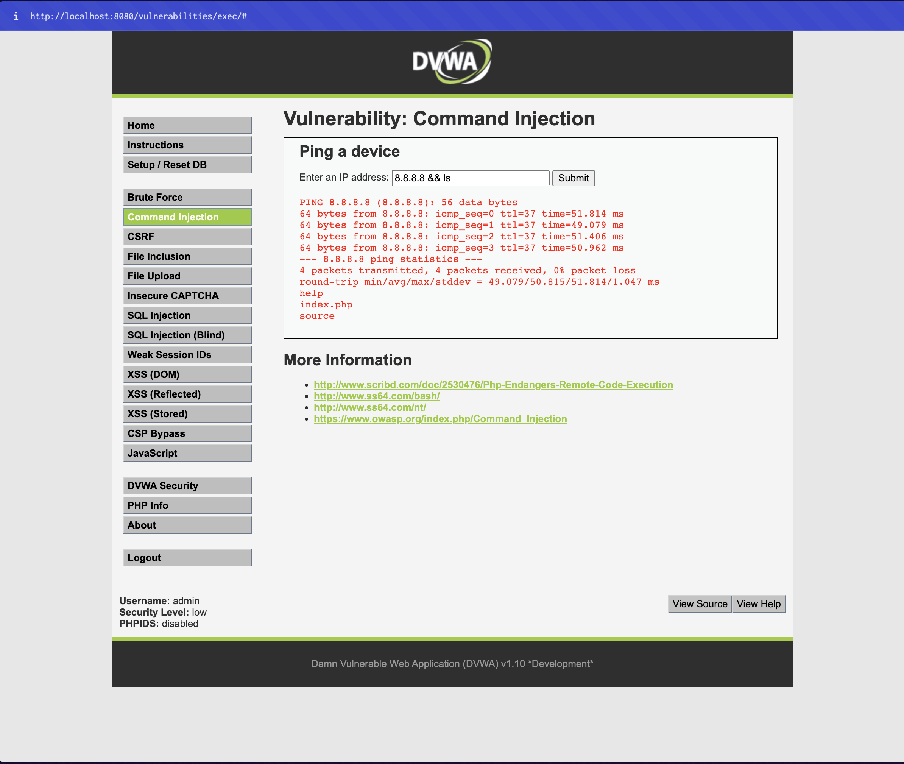
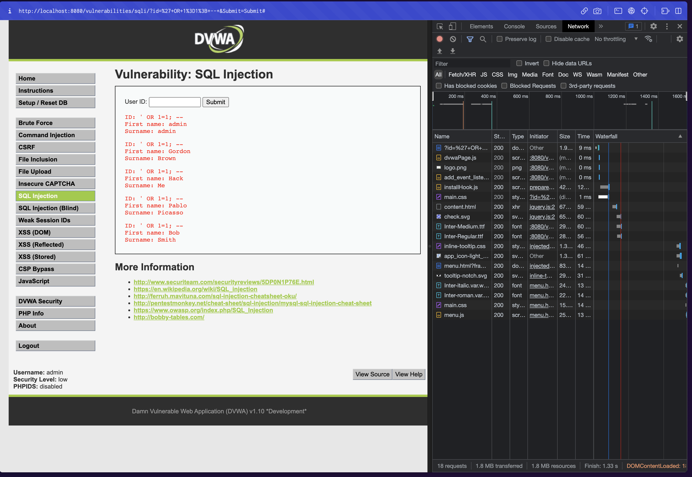
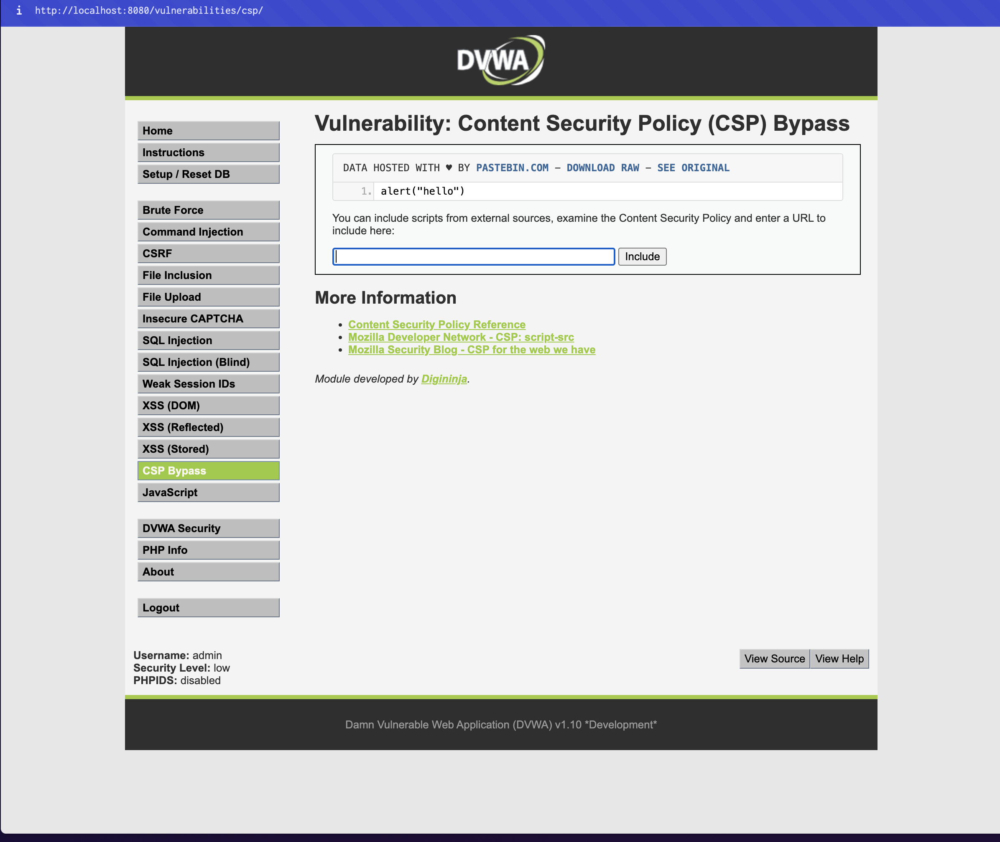
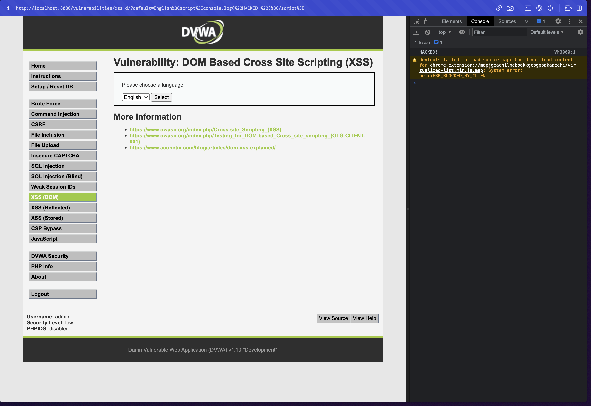
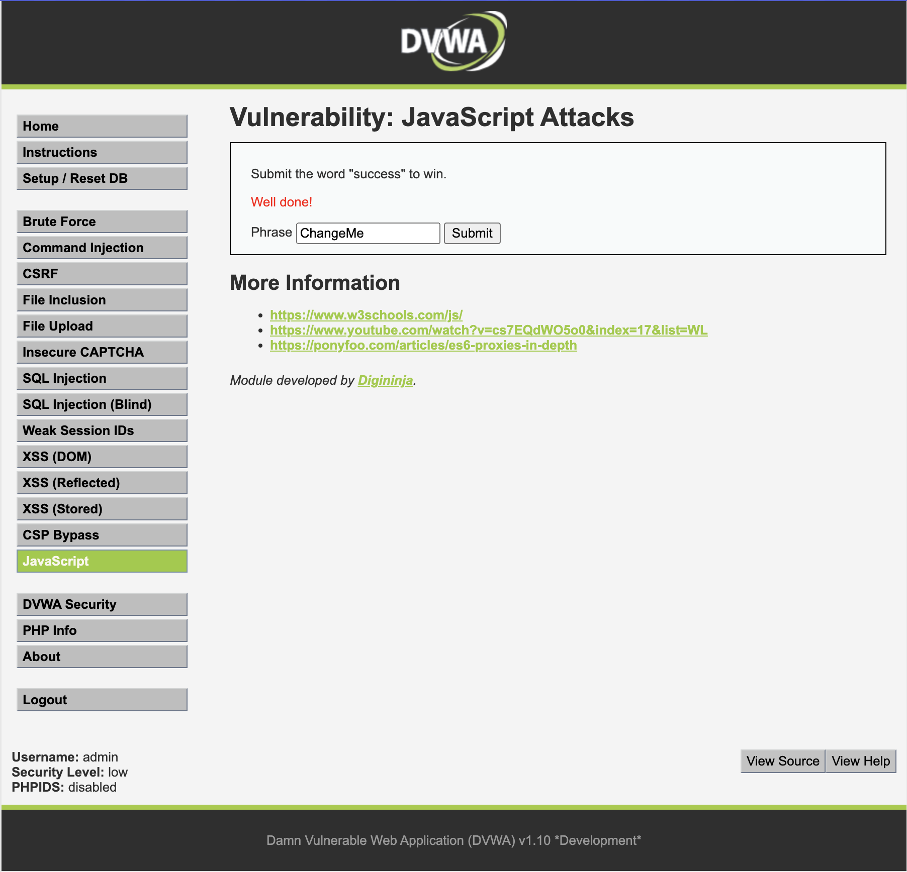
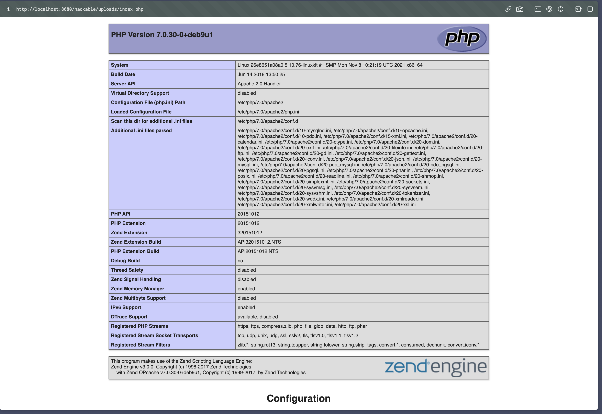

# Term Project <!-- omit in toc -->

By Saenyakorn Siangsanoh 6232035721

The purpose of this project is to educate you with the fundamentals of security in web applications (secure coding) by fixing the vulnerable application.

# Table of Contents <!-- omit in toc -->

- [How to start DVWA](#how-to-start-dvwa)
- [Instructions](#instructions)
- [Vulnerabilities](#vulnerabilities)
  - [1. Bruce Force](#1-bruce-force)
    - [Exploitability](#exploitability)
    - [Weakness Prevalence](#weakness-prevalence)
    - [Weakness Detecability](#weakness-detecability)
    - [Technical Impact](#technical-impact)
    - [Fixes](#fixes)
  - [2. Command Injection](#2-command-injection)
    - [Exploitability](#exploitability-1)
    - [Weakness Prevalence](#weakness-prevalence-1)
    - [Weakness Detecability](#weakness-detecability-1)
    - [Technical Impact](#technical-impact-1)
    - [Fixes](#fixes-1)
  - [3. CRSF](#3-crsf)
    - [Exploitability](#exploitability-2)
    - [Weakness Prevalence](#weakness-prevalence-2)
    - [Weakness Detecability](#weakness-detecability-2)
    - [Technical Impact](#technical-impact-2)
    - [Fixes](#fixes-2)
  - [4. SQL Injection](#4-sql-injection)
    - [Exploitability](#exploitability-3)
    - [Weakness Prevalence](#weakness-prevalence-3)
    - [Weakness Detecability](#weakness-detecability-3)
    - [Technical Impact](#technical-impact-3)
    - [Fixes](#fixes-3)
  - [5. CSP (Content Security Policy) Bypass](#5-csp-content-security-policy-bypass)
    - [Exploitability](#exploitability-4)
    - [Weakness Prevalence](#weakness-prevalence-4)
    - [Weakness Detecability](#weakness-detecability-4)
    - [Technical Impact](#technical-impact-4)
    - [Fixes](#fixes-4)
  - [6. XSS (Cross-site scripting)](#6-xss-cross-site-scripting)
    - [Exploitability](#exploitability-5)
    - [Weakness Prevalence](#weakness-prevalence-5)
    - [Weakness Detecability](#weakness-detecability-5)
    - [Technical Impact](#technical-impact-5)
    - [Fixes](#fixes-5)
  - [7. Weak Session IDs](#7-weak-session-ids)
    - [Exploitability](#exploitability-6)
    - [Weakness Prevalence](#weakness-prevalence-6)
    - [Weakness Detecability](#weakness-detecability-6)
    - [Technical Impact](#technical-impact-6)
    - [Fixes](#fixes-6)
  - [8. Javascript](#8-javascript)
    - [Exploitability](#exploitability-7)
    - [Weakness Prevalence](#weakness-prevalence-7)
    - [Weakness Detecability](#weakness-detecability-7)
    - [Technical Impact](#technical-impact-7)
    - [Fixes](#fixes-7)
  - [9. File Upload](#9-file-upload)
    - [Exploitability](#exploitability-8)
    - [Weakness Prevalence](#weakness-prevalence-8)
    - [Weakness Detecability](#weakness-detecability-8)
    - [Technical Impact](#technical-impact-8)
    - [Fixes](#fixes-8)

# How to start DVWA

Just use `docker-compose.yaml` from this folder. Then run

```
docker compose up -d
```

# Instructions

For each vulnerability, suggest/show a fix for it. If it is a threat (cannot be fixed), please suggest a mitigation methodology. Please **highlight/explain** the concept clearly.

# Vulnerabilities

## 1. Bruce Force

| Exploitability | Weakness Prevalence | Weakness Detecability | Technical Impact |
| :------------: | :-----------------: | :-------------------: | :--------------: |
|  Average (2)   |   Widespread (3)    |       Easy (3)        |   Moderate (2)   |

URL: [http://localhost:8080/vulnerabilities/brute/](http://localhost:8080/vulnerabilities/brute/)

คือการสุ่มหา password ที่ถูกต้องจาก username ที่เราอาจจะรู้อยู่แล้วด้วยการลองสร้าง password ขึ้นมาแบบสุ่ม ๆ แล้วลอง login ดูว่าเข้าสู่ระบบได้หรือไม่



### Exploitability

ซึ่งการทำ bruce force ไม่ได้ทำได้ยากมากนัก แต่อาจจะต้องใช้ effort เล็กน้อยในการเขียน script เพื่อให้ hacker สามารถสุ่มรหัสและลอง login ได้อย่างต่อเนื่อง

### Weakness Prevalence

เป็น vulnerability ที่มีความเป็นไปได้ที่จะเกิดขึ้นได้ทุกที่ โดยเฉพาะเว็บที่มีการ login โดยใช้ username และ password ที่ไม่มี CAPTCHA หรือ 2FA หรือไม่มี attempt limitation

### Weakness Detecability

ตรวจสอบได้ง่าย โดยการลอง login ดูด้วยจำนวนครั้งมาก ๆ ว่ามีปัญหาอะไรหรือไม่ ถ้าไม่แปลว่าสามารถ brute force ได้

### Technical Impact

ค่อนข้างร้ายแรง เพราะว่าหาก hacker สามารถเข้าสู่ระบบด้วย admin ได้ อาจจะทำให้ข้อมูลของระบบเสียหายได้

### Fixes

- ใช้ CAPTCHA หรือ 2FA เพิ่มเติมในการ login เข้าสู่ระบบ
- จำกัดจำนวนครั้งในการ login เข้าสู่ระบบของ user คนหนึ่งต่อช่วงระยะเวลาหนึ่ง

## 2. Command Injection

| Exploitability | Weakness Prevalence | Weakness Detecability | Technical Impact |
| :------------: | :-----------------: | :-------------------: | :--------------: |
|  Average (2)   |    Uncommon (1)     |      Average (2)      |    Severe (3)    |

URL: [http://localhost:8080/vulnerabilities/exec/#](http://localhost:8080/vulnerabilities/exec/#)

คือการส่ง command ผ่าน input ใน website กลับไปให้ server ซึ่ง server จะเอา command นั้นไป execute ตรง ๆ โดยไม่มีการตรวจสอบ



### Exploitability

ความยากในการ exploit อยู่ในระดับปานกลาง เนื่องจาก hacker จำเป็นทืี่จะต้องรู้ linux command เสียก่อน

### Weakness Prevalence

เป็น vulnerability ที่มีโอกาสเจอได้น้อย เพราะว่าปัจจุบันมี library ในการ execute command ที่มีการตรวจสอบ input อยู่เยอะมากแล้ว แต่อาจจะเจอได้กับ website ที่มีอายุเยอะ หรือ website ที่ไม่ได้ใช้ library ที่มีการตรวจสอบ input

### Weakness Detecability

อาจจะตรวจสอบไม่ได้จาก client-side source code เพราะ command จะส่งไป execute ที่ server แต่ก็สามารถตรวจสอบได้ว่ามี vulnerability หรือไม่ โดยการลองส่ง basic linux command ไปให้ server แล้วดู response

### Technical Impact

ร้ายแรงมาก เพราะเสมือนว่า hacker เข้าถึง server ของระบบได้แล้ว ที่เหลือ hacker อยากจะทำอะไรก็สามารถทำได้เลย เช่นแอบเอา SSH Public key ของตัวเองเอาไปใส่ไว้ใน server เพื่อที่ hacker จะได้ login เข้า server ตรง ๆ ได้ หรืออาจจะแอบติดตั้ง malware ไว้ใน server ก็ได้

### Fixes

- หยุดการใช้ `exec` / `eval` ตรง ๆ แล้วเปลี่ยนไปใช้ library ที่มีคนทำเรื่องการตรวจสอบ input ให้แล้ว
- validate input ทุกครั้ง ก่อนที่จะนำไปใช้งาน โดยการใช้ whitelist หรือ blacklist ก็ได้ แต่เพื่อความปลอดภัยสูงสุด จะแนะนำให้ใช้ whitelist แทน เช่น Regex

## 3. CRSF

| Exploitability | Weakness Prevalence | Weakness Detecability | Technical Impact |
| :------------: | :-----------------: | :-------------------: | :--------------: |
|    Easy (3)    |    Uncommon (1)     |       Easy (3)        |   Moderate (2)   |

URL: [http://localhost:8080/vulnerabilities/csrf/?password_new=password&password_conf=password&Change=Change#](http://localhost:8080/vulnerabilities/csrf/?password_new=password&password_conf=password&Change=Change#)

ในกรณีของ DVWA จะสังเกตได้ว่า URL หลังจากลองเปลี่ยน password คือ `http://localhost:8080/vulnerabilities/csrf/?password_new=password&password_conf=password&Change=Change#` ดังนั้นเราสามารถสร้าง URL ที่มี parameter ตามที่เราต้องการแล้วส่งไปให้เพื่อนกด จากนั้นเราก็จะรู้ password ของเพื่อนคนนั้นโดยปริยาย

### Exploitability

การ exploit vulnerability นี้่ค่อนข้างง่าย เนื่องจากเป็นการแก้ URL query parameters เท่านั้น

### Weakness Prevalence

ไม่ค่อยพบในปัจจุบัน เพราะการใช้ OAuth มีความนิยมมากขึ้น เนื่องจากว่าง่ายและไม่ต้อง implement ระบบ login / forgot password ของตัวเอง

### Weakness Detecability

ตรวจสอบได้ง่าย เนื่องจากดูจาก URL ที่ถูกส่งมาก็พอจะทราบได้ว่าต้องเป็นการโจมตีบางอย่าง

### Technical Impact

ค่อนข้างร้ายแรง หากคนที่โดยการโจมตีนี้เป็น admin ดังนั้น hacker ก้จะสามารถใช้งานระบบได้อย่างเต็มที่

### Fixes

- หยุดการรับ input จาก query parameters
- ให้ผู้ใช้กรอก current password เพื่อเป็นการ confirm ว่าต้องการเปลี่ยน password จริง ๆ
- ใช้ CSRF Token ที่จะตรวจสอบว่า request ที่กำลังจะเกิดขึ้นเป็น request เกิดที่ต่อกันมาจริง ๆ หรือไม่

## 4. SQL Injection

| Exploitability | Weakness Prevalence | Weakness Detecability | Technical Impact |
| :------------: | :-----------------: | :-------------------: | :--------------: |
|  Average (2)   |   widespread (3)    |      Average (2)      |   Servere (3)    |

URL: [http://localhost:8080/vulnerabilities/sqli/?id=%27+OR+1%3D1%3B+--+&Submit=Submit#](http://localhost:8080/vulnerabilities/sqli/?id=%27+OR+1%3D1%3B+--+&Submit=Submit#)

เป็นการที่ hacker สามารถใส่ SQL command ผ่าน input ของ web application เพื่อให้เกิดผลบางอบ่างเช่น เพิ่มข้อมูลที่ไม่ควรเพิ่ม, ดูข้อมูลที่ไม่ควรดู, หรือลบข้อมูลที่ไม่ควรลบ

อย่างในกรณีนี้คือ ลองใส่ `' OR 1=1; -- ` ไปในช่อง input



### Exploitability

การ exploit vulnerability นี่อยู่ในระดับปานกลาง เนื่องจาก hacker ตอนจินตนาการด้วยว่า developer implement input นี้อย่างไร และ hacker จะต้องมีความรู้ SQL ด้วนประมาณหนึ่ง

### Weakness Prevalence

ค่อนข้างพบได้แพร่หลายในเว็บที่มีอายุ เนื่องจาก server program ส่วนใหญ่จะ execute SQL command โดยตรง โดยไม่มีการ validate input ที่ผู้ใช้กรอกเข้ามา

### Weakness Detecability

ค่อนข้างตรวจสอบได้ยาก เนื่องจาก code ส่วนที่มีปัญหามักจะอยู่ฝั่ง server ซึ่ง hacker จะต้องลอง exploit ดูเท่านั้น

### Technical Impact

ค่อนข้างร้ายแรง เนื่องจากว่าหากเราไม่ได้ทำ Database backup ไว้ เราก็อาจจะโดน hacker drop database ทิ้งจนทำให้ข้อมูลหายทั้งหมดได้

### Fixes

- ใช้ ORM (Object-relational mapping) แทนการเขียน SQL command ด้วยตัวเอง เนื่องจากเป็น library ที่มีการ develop อย่างต่อเนื่องโดยคนทั่วโลก
- ทำการ validate input อย่างละเอียดก่อนใช้งานเสมอ

## 5. CSP (Content Security Policy) Bypass

| Exploitability | Weakness Prevalence | Weakness Detecability | Technical Impact |
| :------------: | :-----------------: | :-------------------: | :--------------: |
| Difficult (1)  |    Uncommon (1)     |      Average (2)      |    Minor (1)     |

URL: [http://localhost:8080/vulnerabilities/csp/](http://localhost:8080/vulnerabilities/csp/)

เป็นการที่ developer เปิดช่องให้ hacker สามารถโหลด script จากที่อื่นมาใส่ใน website ได้ อย่างในกรณีนี้คือลองเขียน javascript แล้วส่งให้ website ผ่าน input



### Exploitability

ค่อนข้างยากประมารหนึ่ง เนื่องจาก hacker จะต้องใช้ effort สำหรับการเตรียม script เพื่อ load เข้า website เป้าหมาย

### Weakness Prevalence

ไม่ค่อยพบ เพราะว่า website ส่วนใหญ่ไม่มีความจำเป็นต้อง load script จากภายนอกที่ user เป็นคนกรอกเข้ามา

### Weakness Detecability

ตรวจพอค่อนข้างปานกลาง hacker ต้องใช้เวลาในการหาจุดที่ developer เปิดช่องให้ load script จ่ากข้างนอกได้

### Technical Impact

ไม่ค่อยร้ายแรง เนื่องจาก script นั้นจะอยู่แค่ใน browser ของ hacker เท่านั้น ยกเว้นแต่ developer เก็บ external script กลับไปที่ server ด้วย

### Fixes

- ปิดช่องให้ user สามารถ load external script ได้

## 6. XSS (Cross-site scripting)

| Exploitability | Weakness Prevalence | Weakness Detecability | Technical Impact |
| :------------: | :-----------------: | :-------------------: | :--------------: |
|  Average (2)   |   Widespread (3)    |      Average (2)      |   Moderate (2)   |

URL: [http://localhost:8080/vulnerabilities/xss_d/?default=English%3Cscript%3Ealert(%27hacked%27)%3C/script%3E](<http://localhost:8080/vulnerabilities/xss_d/?default=English%3Cscript%3Ealert(%27hacked%27)%3C/script%3E>)

เป็นการที่ input ของ hacker มี javascript แอบไว้อยู่ ซึ่งจะทำให้ browser execute script นั้นออกมา โดย script นั้นอาจจะทำอะไรบางอย่างเพื่อให้ hacker ได้ผลประโยชน์ เช่น แอบดึงข้อมูลบางอย่างจาก user แล้วส่งข้อมูลกลับไปให้ hacker



### Exploitability

การ exploit vulnerability นี่อยู่ในระดับปานกลาง เนื่องจาก hacker จะต้องใช้จินตนาการว่า จะใส่ script แบบไหนดี แล้วจะให้ script นั้นทำอะไร นอกจากนี้ hacker ยังจะต้องรู้ด้วยว่า script ของตัวเองจะทำงานอย่างไรบน browser ที่เป้าหมายใช้

### Weakness Prevalence

ค่อนข้างพบได้แพร่หลายในเว็บที่มีอายุ เนื่องจาก developer มักจะลืม escape ตัวอักษรพิเศษที่มีความหมายใน HTML อยู่ เช่น <, >, &, " และ ' ซึ่งเป็นการเปิดช่องให้ hacker โจมตีด้วย XSS ได้

### Weakness Detecability

ตรวจพบได้ยาก เพราะต้องตรวจสอบ source code ดูเท่านั้น หรือไม่ก็ต้องลอง exploit ดู

### Technical Impact

ความร้ายแรงค่อนข้างน้อย เพราะไม่ได้เป็นการโจมตีระบบโดยตรง แต่เป็นการเล่นงาน end user มากกว่า

### Fixes

- ให้ทำการ escape string ทุกครั้งเมื่อรับ input มา
- ใช้ Framework / Library ที่มีความทันสมัย และมีการแก้ไข security issue อยู่เสมอ

## 7. Weak Session IDs

| Exploitability | Weakness Prevalence | Weakness Detecability | Technical Impact |
| :------------: | :-----------------: | :-------------------: | :--------------: |
|    Easy (3)    |    Uncommon (1)     |       Easy (3)        |   Moderate (2)   |

URL: [http://localhost:8080/vulnerabilities/weak_id/](http://localhost:8080/vulnerabilities/weak_id/)

เป็นการที่ session id เดาได้ง่ายเกินไป ซึ่ง hacker อาจจะนำ session id นั้นไปปลอมตัว สวมรอยเป็นคนอื่น เพื่อใช้งานระบบ

### Exploitability

ค่อนข้างง่าย เนื่องจากแค่หากเราเข้าไปดู cookie แล้วพบว่า session id สามารถเดาได้ ก็สามารถลอง set session id เป็นอันอื่นดูได้เลย

### Weakness Prevalence

ค่อนข้างพบได้ยาก เนื่องจาก developer มักจะใช้ session id ที่ random และยาวมาก แต่ถ้าเป็นการใช้ session id ที่สั้น หรือเป็นตัวเลข ก็อาจจะพบได้ง่าย

### Weakness Detecability

ตรวจพบได้ง่าย เพียงแต่ดู cookie จาก browser ก็จะรู้ได้เลย

### Technical Impact

ความร้ายแรงอยู่ในระดับปานกลาง เพราะไม่ได้เป็นการโจมตีระบบโดยตรง แต่เป็นการเล่นงาน end user มากกว่า

### Fixes

- ใช้ session id ที่ random และยาวมาก จนไม่สามารถเดาได้

## 8. Javascript

| Exploitability | Weakness Prevalence | Weakness Detecability | Technical Impact |
| :------------: | :-----------------: | :-------------------: | :--------------: |
| Difficult (1)  |     Common (2)      |     Difficult (1)     |    Minor (1)     |

URL: [http://localhost:8080/vulnerabilities/javascript/](http://localhost:8080/vulnerabilities/javascript/)

เป็นการใช้ javascript function ที่ developer เป็นคนเขียนทิ้งไว้ เพื่อ bypass บางอย่าง หรือใช้ javascript ในการ execute โค้ดที่ไม่ได้รับอนุญาต



### Exploitability

ค่อนข้างยาก เนื่องจาก hacker จะต้องไปดูและทำความเข้าใจ source code ของ website ก่อน

### Weakness Prevalence

พบได้ทั่วไป เนื่องจากไม่มีวิธีป้องกัน hacker จากการใช้ function ที่ developer เขียนไว้บน website

### Weakness Detecability

ค่อนข้างยาก เนื่องจาก hacker จะต้องไปดูและทำความเข้าใจ source code ของ website ก่อน

### Technical Impact

มีผลน้อย เนื่องจากด้วยวิธีนี้ hacker จะโจมตีได้แบบจำกัด เว้นเสียแต่ว่า developer จะเขียน code ไม่ดี

### Fixes

- ไม่มีวิธีป้องกันได้ 100% เนื่องจากผู้ใช้ทุกคนสามารถอ่าน source code ของ website ได้
- พยายามใช้ parser ที่มีความปลอดภัยสูง และทำให้ complied code อ่านได้ยากขึ้น ซึ่งจะทำให้ hacker ทำความเข้าใจ code ได้ยากขึ้นด้วย

## 9. File Upload

| Exploitability | Weakness Prevalence | Weakness Detecability | Technical Impact |
| :------------: | :-----------------: | :-------------------: | :--------------: |
|  Average (2)   |     Common (2)      |       Easy (3)        |   Moderate (2)   |

URL: [http://localhost:8080/vulnerabilities/upload/](http://localhost:8080/vulnerabilities/upload/)

upload `index.php`

```php
<?php phpinfo(); ?>
```

เป็นการ upload script file ขึ้นไป แทนที่จะเป็นการ upload รูปหรือ video หากระบบเผลออ่าน script นั้นโดยไม่ได้ตั้งใจ ก็จะทำให้ script นั้นถูก execute ออกมา และอาจจะทำอันตรายกับระบบหรือขโมยข้อมูลได้

URL: [http://localhost:8080/hackable/uploads/index.php](http://localhost:8080/hackable/uploads/index.php)



### Exploitability

hacker ต้องใช้ effort ประมาณหนึ่งในการเขียน script เพื่อขโมยข้อมูลอะไรบางอย่างจากระบบหรือ developer

### Weakness Prevalence

พบได้ค่อนข้างง่าย เพราะ developer มักจะไม่ค่อย check file type ในฝั่ง backend

### Weakness Detecability

ค่อนข้างง่าย หากในส่วนหน้าบ้านไม่ได้มีการ check file type หรือหาก restrict file type ก้สามารถแก้ไข DOM เองแล้ว upload ไฟล์ก็ได้

### Technical Impact

ค่อนข้างมีผล หากระบบเผลอ execute script ที่ hacker ส่งมา จะทำให้ hacker สามารถขโมยข้อมูลได้

### Fixes

- พยายาม validate input ที่ให้มาว่ามี script อะไรฝังอยุ่หรือไม่
- พยายามดู file type ว่าเป็นไฟล์ image หรือไม่
- ลองดู metadata ของ file ว่าเป็น file ที่ต้องการหรือไม่
